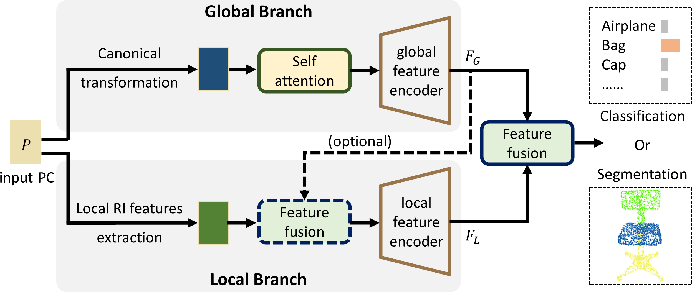

# Rethinking Local-to-Global Representation Learning for Rotation-Invariant Point Cloud Analysis
by Zhaoxuan Wang, Yunlong Yu and [Xianzhi Li](https://nini-lxz.github.io/) <br>
in *Pattern Recognition 2024* [paper] [supp.]

## Introduction
This repository is the official implementation of "**Rethinking Local-to-Global Representation Learning for Rotation-Invariant Point Cloud Analysis**" in Pattern Recognition (PR). <br><br>
In this paper, we propose a novel rotation-invariant method that embeds both distinctive local and global rotation-invariant information. Specifically, we design a two-branch network that separately extracts purely local and global rotation-invariant features. 
In the global branch, we leverage canonical transformation to extract global representations, while in the local branch, we utilize hand-crafted geometric features to embed local representations.
To fuse the features from distinct branches, we introduce an attention-based fusion module to adaptively integrate the local-to-global representation by considering the geometry contexts of each point. 
Particularly, different from existing rotation-invariant works, we further introduce a self-attention unit into the global branch for embedding non-local information and also insert multiple fusion modules into the local branch to emphasize the global features. <br>

<div align=center>
    
</div>

If you have any questions about this work, please open an issue or contact us.

## Environment
We train & test under the environment listed below, _the higher version of CUDA may not be compatible_.
- PyTorch = 1.7.0<br>
- CUDA = 11.0<br>
- Python = 3.8<br>
- Ubuntu = 20.04<br>
- GPU = Nvidia RTX 3090×1

## Prerequisites
- ### torch-batch-svd installation<br>
    > reference to the [torch-batch-svd](https://github.com/KinglittleQ/torch-batch-svd) GitHub page.<br>
    ```
    sudo git clone https://github.com/KinglittleQ/torch-batch-svd
    export CUDA_HOME=/your/cuda/home/directory/
    cd torch-batch-svd
    python setup.py install
    ```
- ### packages installation
  ```
  pip install -r requirements.txt
  ```
- ### datasets preparation
  - #### ModelNet40
      download the ModelNet40 [here](https://shapenet.cs.stanford.edu/media/modelnet40_normal_resampled.zip), and place the unzipped files in `dataset/modelnet40_normal_resampled`
  - #### ScanObjectNN
      download ScanObjectNN h5 files [here](https://hkust-vgd.github.io/scanobjectnn/), and place the unzipped files in `dataset/ScanObjectNN/h5_files`
  - #### ShapeNet Part
      download ShapeNet Part [here](https://shapenet.cs.stanford.edu/media/shapenetcore_partanno_segmentation_benchmark_v0_normal.zip), and place the unzipped files in `dataset/shapenetcore_partanno_segmentation_benchmark_v0_normal`<br><br>
      overall, the `dataset` folder structure is as follows:
      ```
      ├── Data
      ├── dataset
      │   ├── modelnet40_normal_resampled
      │   │   ├── airplane
      │   │   │   │── airplane_0001.txt
      │   │   │   │── ...
      │   │   ├── bathtub
      │   │   ├── ...
      │   │   ├── modelnet40_train.txt
      │   │   ├── modelnet40_train_1024pts.dat
      │   ├── ScanObjectNN
      │   │   │── h5_files
      │   │   │   │── main_split
      |   |   |   |── main_split_nobg
      │   ├── shapenetcore_partanno_segmentation_benchmark_v0_normal
      │   │   ├── 02691156
      │   │   ├── ...
      │   │   ├── synsetoffset2category.txt   
      ├── log
      ├── Networks
      ├── ...
      ```

## Training
```
cd scripts/train/
# ModelNet40
sh PaRINet_rot_z.sh # for ModelNet40 with normals in z case
sh PaRINet_rot_z_glob_bary.sh # for ModelNet40 without normals in z case
sh PaRINet_so3.sh # for ModelNet40 with normals in SO3 case
sh PaRINet_so3_glob_bary.sh # for ModelNet40 without normals in SO3 case
# ScanObjectNN
sh Scan_rot_z.sh # for ScanObjectNN in z case
sh Scan_so3.sh # for ScanObjectNN in SO3 case
# ShapeNet Part
sh seg_rot_z.sh # for ShapeNet Part with normals in z case
sh seg_so3.sh # for ShapeNet Part with normals in SO3 case
```

To visualize the training process, please run:
```
tensorboard --logdir log
```

## Testing
  ### Pre-trained models
  We provide pre-trained models for classification and segmentation tasks. _The models are trained with normals in z case._
  | datasets    | Acc. / mIOU |    links    |
  | :-----------: | :-----------: | :-----------: |
  | ModelNet40     | 93.2%       | [Google Drive](https://drive.google.com/file/d/16oASX1ocYH7S1f1Zl3DWN7csWiRHLBdP/view?usp=drive_link) / [Baidu NetDisk](https://pan.baidu.com/s/1qS-BgfKb1JjL1Bo117RUjg) (code: 4qsz)       |
  | ScanObjectNN   | 78.6% (PB_T50_RS)       | [Google Drive](https://drive.google.com/file/d/1OY35bB8op2Jn9oJp5nlfdADIQCP_LywF/view?usp=drive_link) / [Baidu NetDisk](https://pan.baidu.com/s/1RnEx1qoGzLQyuzo7ELyf8g) (code: y8tm)      |
  | ShapeNet Part  | 83.3%        | Google Drive / Baidu NetDisk       |
  
  For example, readers can download the provided pre-trained model for ModelNet40, and place the `.pth` files in `log/PaRINet_rot_z/best/modelnet40_rotz.pth` to test the performance for ModelNet40 with normals in z or SO3 case.<br><br>
```
cd scripts/test/
# ModelNet40
sh test_PaRINet_rot_z.sh # for ModelNet40 with normals in z case
sh test_PaRINet_rot_z_glob_bary.sh # for ModelNet40 without normals in z case
sh test_PaRINet_so3.sh # for ModelNet40 with normals in SO3 case
sh test_PaRINet_so3_glob_bary.sh # for ModelNet40 without normals in SO3 case
# ScanObjectNN
sh test_Scan_rot_z.sh # for ScanObjectNN in z case
sh test_Scan_so3.sh # for ScanObjectNN in SO3 case
# ShapeNet Part
sh test_seg_rot_z.sh # for ShapeNet Part with normals in z case
sh test_seg_so3.sh # for ShapeNet Part with normals in SO3 case
```

  _**Note:**_ Due to the _random_ factor of testing, the results may not be identical for multiple runs, please run several times to obtain the best performance.

## Results
### Shape Classification

  <table>
    <tr align="center">
        <th>dataset</th><th>methods</th><th>Acc.</th><th>#Params</th><th>dataset</th><th>methods</th><th>Acc.</th>
    </tr>
    <tr align="center">
        <td rowspan="4">ModelNet40</td><td>LGR-Net</td><td>90.9%</td><td>5.55M</td><td rowspan="4">ScanObjectNN(PB_T50_RS)</td><td>LGR-Net</td><td>72.7%</td>
    </tr>
    <tr align="center">
        <td>RIConv++</td><td>91.3%</td><td>0.42M</td><td>RIConv++</td><td>80.3%</td>
    </tr>
    <tr align="center">
        <td>PaRI-Conv</td><td>92.4%</td><td>1.85M</td><td>-</td><td>-</td>
    </tr>
    <tr align="center">
        <td><b>Ours</b></td><td>93.2%</td><td>1.88M</td><td><b>Ours</b></td><td>78.6%</td>
    </tr>
</table>

### Part Segmentation

  <table>
    <tr align="center">
        <th>dataset</th><th>methods</th><th>mIOU</th>
    </tr>
    <tr align="center">
        <td rowspan="4">ShapeNet Part</td><td>LGR-Net</td><td>82.8%</td>
    </tr>
    <tr align="center">
        <td>PaRI-Conv</td><td>84.6%</td>
    </tr>
    <tr align="center">
        <td><b>Ours</b></td><td>83.3%</td>
    </tr>
</table>


## Citation
If you find our work helpful in your research, please consider citing:
